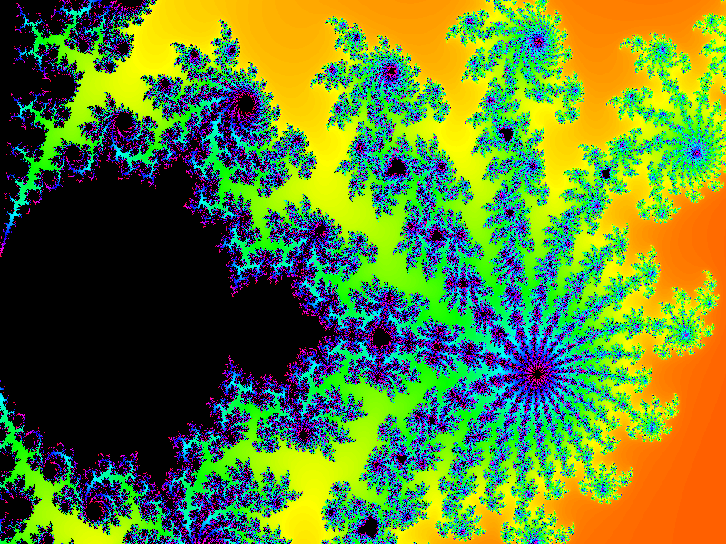
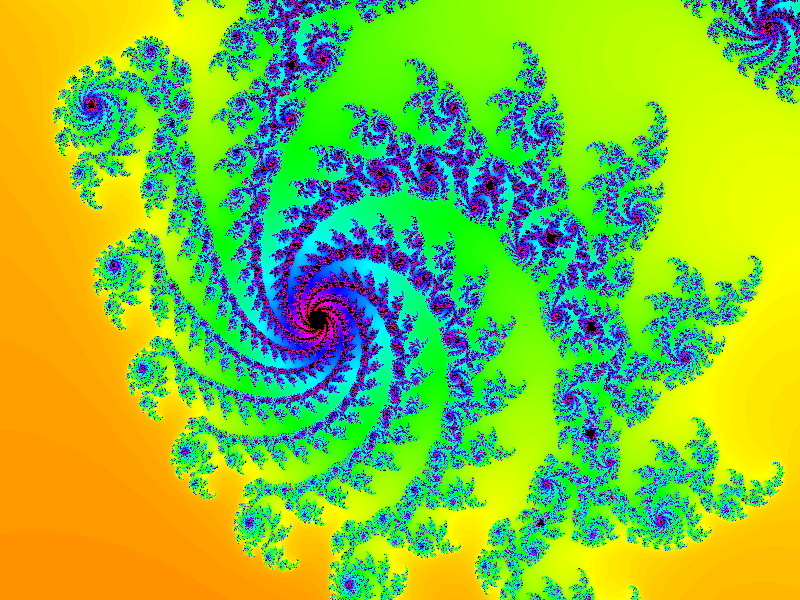
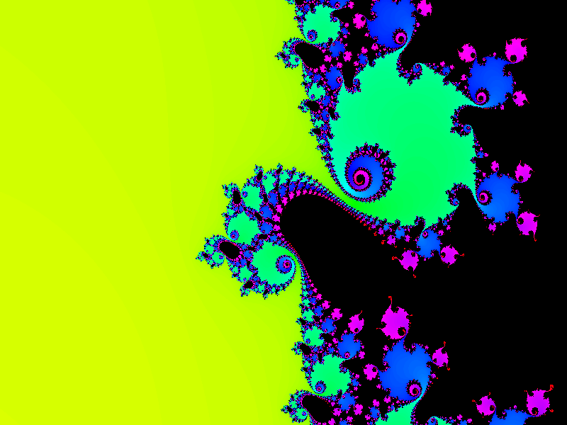
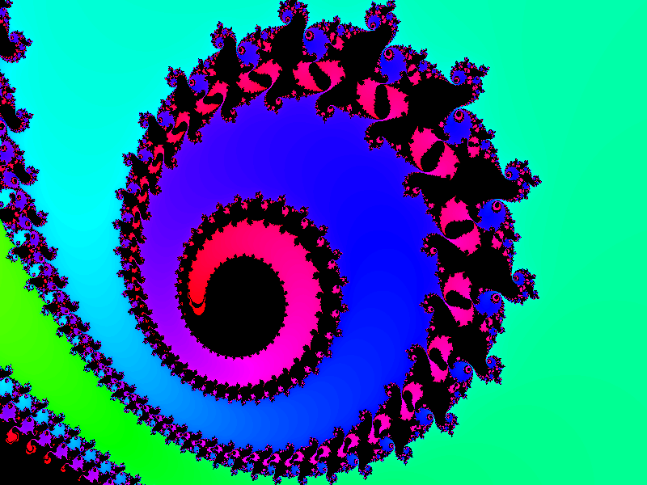
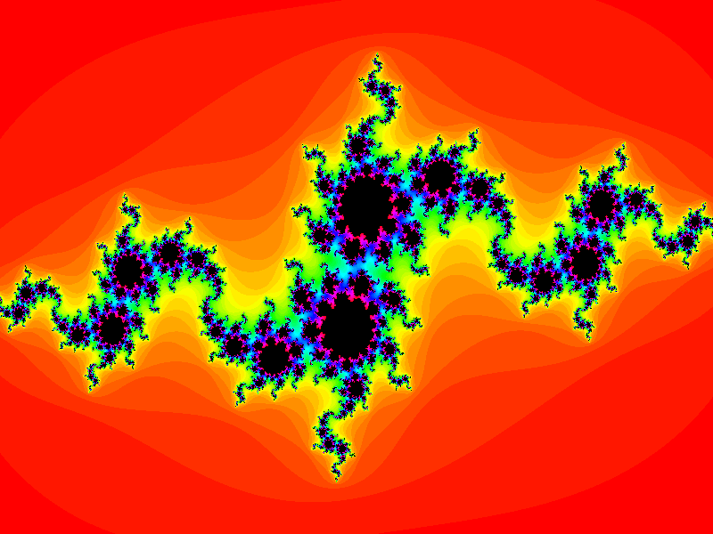
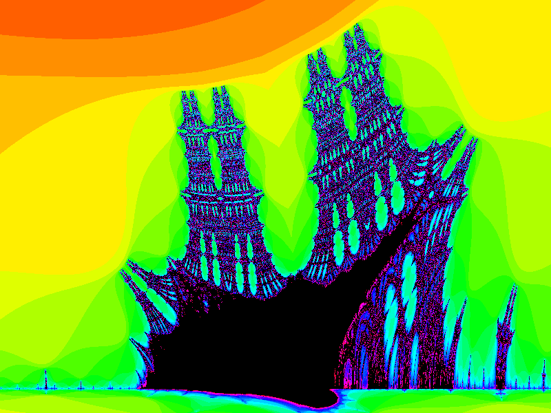

# Fractal Explorer
Simple command line utility to generate visualizations of various escape-time fractals.

## Fractals
Currently these 3 Fractals are supported:
- Mandelbrot set
- Julia set
- Burning Ship fractal

## Frontends
The application has 3 ways to visualize the fractals:
- In a Window using SDL2
- As an image in the PPM format
- As ASCII Art

The default is the SDL2 frontend, the other visualizations can be activated via CLI options.
Currently its non-interactive, but this may change in the future.

## CLI options
- `-a` Set visualization to ASCII.
- `-b` Use block characters for output. Only used with ASCII frontend.
- `-c` Colorize output. Only used with ASCII frontend.
- `-g` Make output Grayscale.
- `-h <int>` Height of the displayed output.
- `-i` Set visualization to image.
- `-o <string>` Output filename. Only used with PPM frontend.
- `-p <int>` Precision or max. number of iterations. Higher values are slower.
- `-r <double>` Radian offset. Only used with the Julia set.
- `-t <type>` Choose what fractal you want to view. Allowed values are `mandelbrot`, `julia` and `burningship`. Defaults to `mandelbrot`.
- `-w <int>` Width of the displayed output.
- `-x <double>` X offset. pos=right, neg=left
- `-y <double>` Y offset. pos=down, neg=up
- `-z <double>` Zoom. Smaller number = more zoom

## Examples
`./run.sh -x 2.374 -y 0.807 -z 0.003 -p 300`

`./run.sh -x 2.3544 -y 0.9055 -z 0.001 -p 250`

`./run.sh -x 1.249 -y 1.05 -z 0.001 -p 300`

`./run.sh -x 1.25061 -y 1.0462 -z 0.00012 -p 300`

`./run.sh -t julia -r3.4 -p 64`

`./run.sh -t burningship -x 0.68 -y 1.9153 -z 0.03`

## Dependencies
- gcc
- Bash or any other POSIX compliant shell
- libm
- SDL2 (optional but recomended)

## References
- [Mandelbrot set](https://en.wikipedia.org/wiki/Mandelbrot_set)
- [Julia set](https://en.wikipedia.org/wiki/Julia_set)
- [Burning Ship fractal](https://en.wikipedia.org/wiki/Burning_Ship_fractal)
- [PPM image format](https://en.wikipedia.org/wiki/Netpbm)
- [HSV to RGB conversion](https://www.rapidtables.com/convert/color/hsv-to-rgb.html)
- [SDL](https://www.libsdl.org/)
